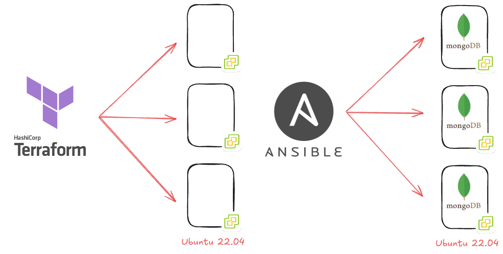

# MongoDB replicaset running on vSphere using Terraform & Ansible

This repository is to build out a demo environment for evaluation and development purposes. 

- Deploy 3 Linux VMs (Ubuntu 22.04 tested) into a vSphere environment using Terraform 
- Using those 3 Linux VMs, Provision a MongoDB replicaset using Ansible 

## Edit main.tf 

Bad practice but ease and speed was the name of the game. All variables are found here for your vSphere environment. Edit this file to suit your environment, also make sure 
that you have an Ubuntu 22.04 template available in your vSphere environment. 

## Edit inventory.ini 

Again bad practice but here you will also need to edit the IPs, authentication etc. for the Ansible playbook to run against the 3 machines. 

### WARNING! Don't be like me, you do not need to push your super secret passwords to github for the world to see! 

## Ready to Run 

We will be using Terraform and Ansible here, so make sure that you have those installed on the machine you wish to run this along with the files updated with your 
information. 

The plan command will let you know if you have any mistakes in your code. 

`terraform plan` 

If all went well then we should be able to run the terraform code to create our 3 vms, you do not have to be like me and YOLO the --auto-approve it just means 
I don't need to say yes. 

`terraform apply --auto-approve`

You can check progress of this process through the terminal or in your vSphere console. The end goal is a message from terraform saying all complete and 3 resources
have been created and everything is green, you will also have 3 new VMs up and running in your environment. You can confirm this with a ping against those IPs
as well as being able to SSH to them if this was configured in the template. 

## Ansible time 

Confirm that you have the inventory file updated with your own environment information. 

`ansible-playbook -i inventory.ini mongodb-playbook.yaml` 

this will run through the tasks to get to the point where MongoDB can be installed on each node and a ReplicaSet is created amongst them. 

*Note at the time of writing this the primary could end up being any of the 3 machines, so in order to add the authentication to the machines we have to connect to the 
primary to add the new user, I need ansible to be able to dynamically learn which VM is the master in the replicaset and then proceed with the creation. 

Remember, this is only for demo purposes, please nobody should use such code in their production environments!  
